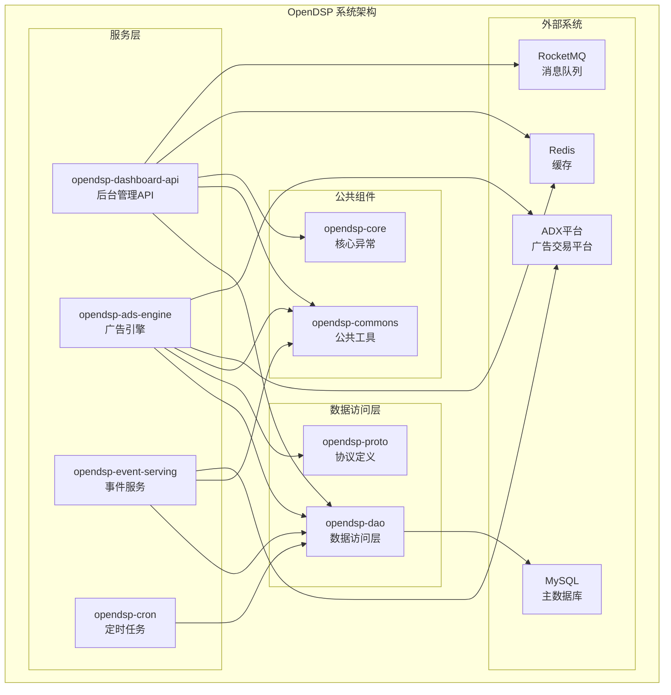
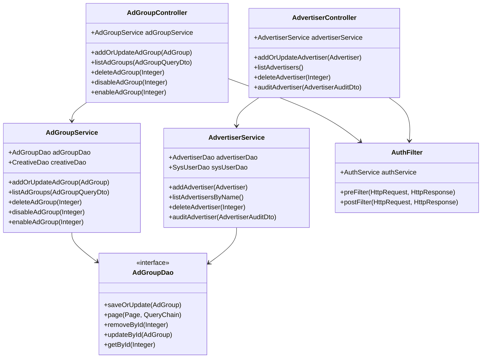
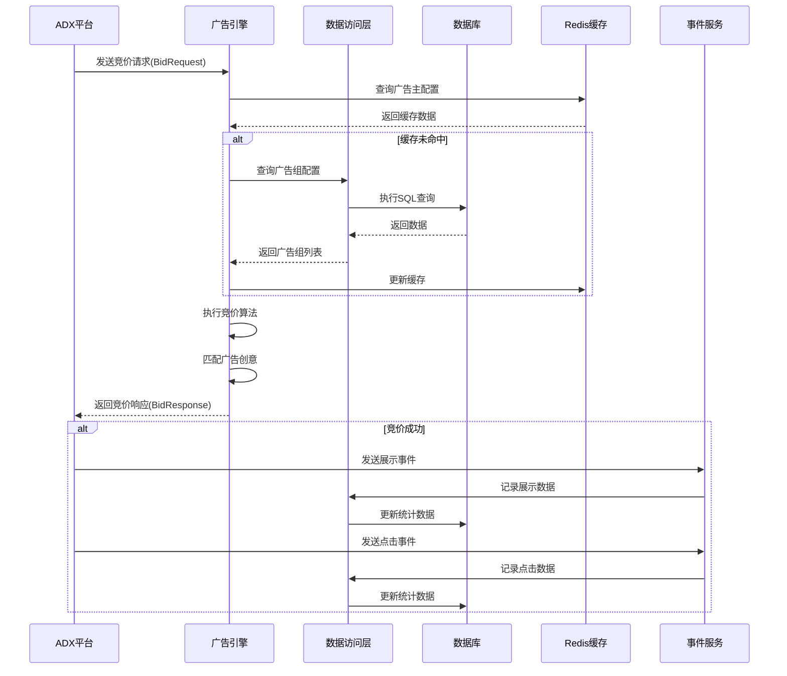
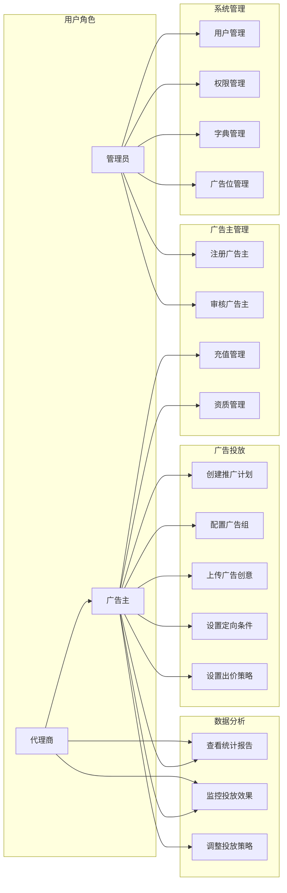
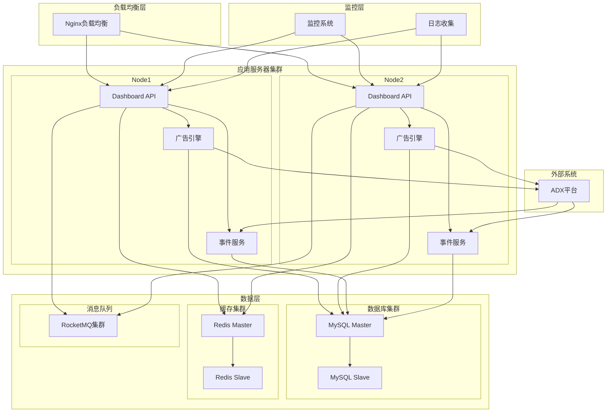
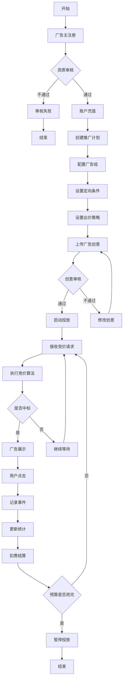
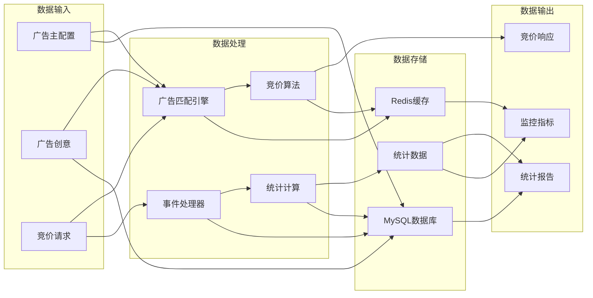

 a# OpenDSP 程序化广告平台技术分析报告

## 项目概述

OpenDSP是一个开源的程序化广告需求方平台（Demand Side Platform），基于Spring Boot 3.4.3和Java 17开发。该项目旨在提供完整的广告投放、竞价、监测和管理功能。

**项目基本信息：**
- 项目名称：OpenDSP
- 版本：0.0.1-SNAPSHOT
- 开发语言：Java 17
- 框架：Spring Boot 3.4.3
- 作者：weiping wang (javagossip@gmail.com)
- 项目地址：https://github.com/javagossip/opendsp

## 技术架构

### 总体架构
OpenDSP采用分层的微服务架构，包含以下核心层次：

1. **服务层（Service Layer）**：广告引擎、事件处理、后台管理API
2. **数据访问层（Data Access Layer）**：基于MyBatis-Flex的ORM层
3. **通信层（Communication Layer）**：gRPC和REST API
4. **基础设施层（Infrastructure Layer）**：Redis缓存、数据库、消息队列

### 技术栈详解

#### 核心框架
- **Spring Boot 3.4.3**: 应用程序主框架
- **MyBatis-Flex 1.10.9**: ORM框架，提供灵的数据访问
- **Dorado**: 自定义的REST API框架
- **gRPC 1.72.0**: 高性能RPC框架，用于微服务间通信

#### 数据存储
- **MySQL**: 主数据库，存储广告主、广告组、创意等核心数据
- **Redis**: 缓存层，支持会话管理和数据缓存
- **Protocol Buffers 4.30.2**: 数据序列化格式

#### 中间件
- **RocketMQ v5**: 消息队列，处理异步事件
- **Jasypt**: 配置文件加密
- **Swagger**: API文档生成

#### 工具库
- **Guava 33.4.0**: Google工具库
- **Fastjson2 2.0.53**: JSON序列化
- **Apache Commons Lang3**: 通用工具
- **BCrypt**: 密码加密
- **Lombok**: 代码生成工具

## 模块架构分析

### 1. opendsp-ads-engine（广告引擎）
**功能**：核心竞价逻辑和广告投放引擎
- `opendsp-ads-engine-core`: 竞价服务核心实现
- `opendsp-ads-engine-serving`: 广告引擎服务启动模块

**技术特点**：
- 基于gRPC的BiddingService实现
- 支持OpenRTB协议
- 待完善的竞价算法实现

### 2. opendsp-dashboard-api（后台管理API）
**功能**：提供广告主管理、广告组配置、数据监控等功能
- RESTful API设计
- 基于Dorado框架
- 集成Swagger API文档
- 支持JWT认证

**核心控制器**：
- `AdGroupController`: 广告组管理
- `AdvertiserController`: 广告主管理
- `CreativeController`: 创意管理

### 3. opendsp-dao（数据访问层）
**功能**：统一的数据访问层
- MyBatis-Flex实现
- 完整的实体模型定义
- 自动代码生成支持

**核心实体**：
- `Advertiser`: 广告主信息
- `AdGroup`: 广告组配置
- `Creative`: 广告创意
- `Campaign`: 推广计划
- `AdSlot`: 广告位

### 4. opendsp-event-serving（事件服务）
**功能**：处理广告展示和点击事件
- `opendsp-impression-serving`: 展示事件处理
- `opendsp-click-serving`: 点击事件处理
- 基于REST API的事件收集

### 5. opendsp-proto（协议定义）
**功能**：定义gRPC服务和消息格式
- 完整的OpenRTB协议实现
- 支持Banner、Video、Native广告类型
- 枚举类型定义

### 6. opendsp-commons（公共组件）
**功能**：共享的工具类和配置
- Redis配置和模板
- 通用工具类

## 数据模型分析

### 核心业务实体关系
```
Advertiser (广告主)
    ↓
Campaign (推广计划)
    ↓
AdGroup (广告组)
    ↓
Creative (广告创意)
    ↓
AdSlot (广告位)
```

### 关键数据表

#### 1. 广告主管理
- `advertiser`: 广告主基本信息
- `advertiser_adx`: 广告主与ADX平台关联
- `advertiser_recharge`: 充值记录
- `advertiser_qualification`: 资质信息

#### 2. 广告投放
- `campaign`: 推广计划
- `ad_group`: 广告组（核心配置）
- `creative`: 广告创意
- `ad_slot`: 广告位定义

#### 3. 统计分析
- `creative_stats`: 创意统计数据
- `ad_stat`: 广告统计（待实现）

#### 4. 系统管理
- `sys_user`: 系统用户
- `sys_role`: 角色管理
- `sys_dict`: 数据字典

### 广告组配置特性
广告组作为核心配置单元，支持：
- **定向功能**：地域、操作系统、设备类型、运营商等
- **出价策略**：CPM、CPC、CPA、oCPM、oCPC
- **预算控制**：日预算、投放时间段
- **频次控制**：用户展示频次限制
- **私有竞价**：PDB、PD、PA支持

## 服务架构设计

### 微服务拆分
1. **广告引擎服务**：负责竞价逻辑和广告匹配
2. **后台管理服务**：提供管理界面和API
3. **事件收集服务**：处理展示和点击事件
4. **定时任务服务**：数据统计和清理

### 通信机制
- **gRPC**: 微服务间高性能通信
- **REST API**: 外部接口和管理界面
- **消息队列**: 异步事件处理

### 数据流架构
```
ADX竞价请求 → 广告引擎 → 竞价响应
     ↓
事件回调 → 事件服务 → 统计处理
     ↓
数据存储 → 报表生成 → 后台展示
```

## 部署架构建议

### 环境要求
- Java 17+
- MySQL 8.0+
- Redis 6.0+
- RocketMQ 5.0+

### 部署方式
1. **单体部署**：适合开发和测试环境
2. **微服务部署**：生产环境推荐
3. **容器化部署**：建议使用Docker和K8s

### 配置管理
- 支持多环境配置（dev、test、prod）
- 敏感信息加密存储
- 外部化配置管理

## 代码质量评估

### 优点
1. **架构清晰**：分层设计合理，模块职责明确
2. **技术选型先进**：使用最新的Spring Boot 3.x和Java 17
3. **代码生成**：MyBatis-Flex支持自动代码生成
4. **协议标准**：遵循OpenRTB标准
5. **文档完整**：集成Swagger API文档

### 待完善点
1. **核心逻辑待实现**：广告引擎的竞价逻辑为空实现
2. **事件处理简单**：点击和展示事件处理逻辑待完善
3. **缺少监控**：没有应用监控和链路追踪
4. **测试覆盖率**：缺少单元测试和集成测试
5. **部署配置**：缺少Docker和CI/CD配置

## 性能优化建议

### 1. 缓存策略
- 广告位信息缓存
- 广告主和创意信息缓存
- 热点数据预加载

### 2. 数据库优化
- 索引优化
- 读写分离
- 分库分表策略

### 3. 服务优化
- 连接池配置
- 异步处理
- 批量操作

## 安全建议

1. **认证授权**：完善JWT认证机制
2. **数据加密**：敏感数据加密存储
3. **API安全**：请求限流和防攻击
4. **日志审计**：操作日志记录

## 扩展性建议

1. **算法插件化**：竞价算法可插拔设计
2. **多ADX支持**：支持多个广告交易平台
3. **机器学习**：集成CTR预估和智能出价
4. **实时计算**：流式数据处理

## 项目成熟度评估

**当前状态**：项目处于早期开发阶段
- 基础架构搭建完成
- 数据模型设计完整
- 核心业务逻辑待实现

**推荐发展路径**：
1. 完善核心竞价逻辑
2. 实现事件处理机制
3. 增加监控和日志
4. 完善测试覆盖
5. 优化性能和稳定性

## UML架构图

### 1. 系统组件图（Component Diagram）



### 2. 核心业务类图（Class Diagram）

```mermaid
classDiagram
    class Advertiser {
        +Integer id
        +String name
        +String password
        +Integer auditStatus
        +String companyName
        +String email
        +String contact
        +Integer status
    }
    
    class Campaign {
        +Integer id
        +String name
        +Integer advertiserId
        +Integer budget
        +LocalDateTime startTime
        +LocalDateTime endTime
        +Integer deliveryMode
        +Integer status
    }
    
    class AdGroup {
        +Integer id
        +String name
        +Integer campaignId
        +Integer advertiserId
        +Integer adSlotId
        +LocalDateTime beginDate
        +LocalDateTime endDate
        +Integer budget
        +Integer biddingMethod
        +Integer bidPrice
        +String landingUrl
        +Integer status
    }
    
    class Creative {
        +Integer id
        +Integer adGroupId
        +String creativeName
        +String creativeUrl
        +String nativeAdContent
        +Integer status
    }
    
    class AdSlot {
        +Integer id
        +String name
        +Integer adType
        +Integer width
        +Integer height
        +Integer status
    }
    
    class CreativeStats {
        +Integer id
        +Integer creativeId
        +Integer advertiserId
        +String statDate
        +Integer impressions
        +Integer clicks
        +Integer conversions
        +Long cost
    }
    
    Advertiser ||--o{ Campaign : "1对多"
    Campaign ||--o{ AdGroup : "1对多"
    AdGroup ||--o{ Creative : "1对多"
    AdGroup }o--|| AdSlot : "多对1"
    Creative ||--o{ CreativeStats : "1对多"
```

### 3. 服务层架构图（Service Layer Architecture）



### 4. RTB竞价流程序列图（RTB Bidding Sequence）



### 5. 广告管理用例图（Ad Management Use Cases）



### 6. 系统部署架构图（Deployment Diagram）



### 7. 广告投放业务流程图（Ad Campaign Activity Diagram）



### 8. 数据流图（Data Flow Diagram）



## 总结

OpenDSP项目具有清晰的架构设计和完整的技术栈，采用了现代化的Java技术和微服务架构。项目的数据模型设计合理，涵盖了DSP平台的核心业务需求。

通过以上UML图可以看出：

1. **系统架构清晰**：分层设计明确，各模块职责分明
2. **业务流程完整**：从广告主注册到广告投放的完整业务闭环
3. **技术选型合理**：使用现代化的技术栈，支持高并发和高可用
4. **扩展性良好**：模块化设计便于功能扩展和维护

虽然项目仍处于早期开发阶段，但基础架构扎实，具有良好的可扩展性。建议按照上述建议完善核心功能，并逐步添加监控、测试和部署配置，最终形成一个完整的商业级DSP平台。 